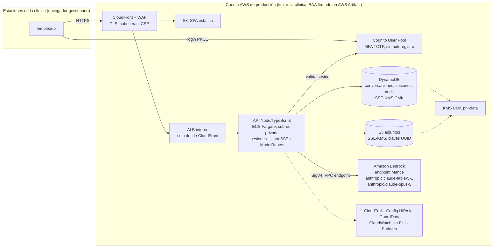

# Interfaz Claude para la clínica sobre Amazon Bedrock — diseño propuesto

Estado: propuesta para discusión (fase "idea"). Fecha: 2026-09-12.
Autor: Helixona, con apoyo de un panel de diseño automatizado (5 propuestas independientes, 8 críticas adversariales, síntesis).

Pedido original: interfaz web propia, con usuario y contraseña, para que los empleados de la clínica usen Claude Fable 5.1 (esfuerzo `medium`) a través de Amazon Bedrock y, si Fable no se puede usar, Claude Opus 5; todo bajo HIPAA y protegiendo la información de pacientes (PHI).

---

## 1. Veredicto

**La idea es correcta y es la vía que recomendamos**: Amazon Bedrock + una aplicación web propia y deliberadamente pequeña + Amazon Cognito para la identidad. Es hoy el único camino autoservicio y verificable para usar Fable 5.1 con PHI, con la clínica como dueña de sus datos, su retención y su auditoría.

Cuatro matices que cambian el diseño respecto al pedido literal:

1. **"Usuario y contraseña" no basta para PHI.** MFA obligatorio, alta solo por administrador, cierre automático por inactividad y revocación real de sesión son requisitos, no opcionales. La identidad la gestiona Cognito; nunca una tabla de contraseñas propia.
2. **"Si Fable no se puede usar" son dos problemas distintos** con dos mecanismos distintos: (a) el clasificador de seguridad declina el pedido (`stop_reason: "refusal"`, HTTP 200) → lo resuelve el middleware de fallback del SDK de Anthropic; (b) el modelo no está disponible (429, 5xx, acceso no habilitado, región) → lo resuelve un router propio en el backend. Bedrock no tiene el parámetro server-side `fallbacks`.
3. **Hay una incógnita contractual que hay que cerrar antes de tocar PHI:** Fable 5.1 exige retención de datos de 30 días en la API de Anthropic y no está disponible bajo Zero Data Retention. En Bedrock "la retención la fija la plataforma", y no tenemos confirmación escrita de qué significa eso. El diseño deja el modelo primario como parámetro: si la respuesta no satisface al oficial de privacidad, el sistema arranca con Opus 5 y Fable se activa después sin cambiar código.
4. **El empleado elige el modelo por conversación: Sonnet, Opus o Fable, siempre en su última versión.** Los tres corren a esfuerzo `medium`. El catálogo de modelos es configuración bajo control de cambios, no código, y cada modelo tiene su propia cadena de respaldo (sección 7b). Recomendamos Opus 5 como default del selector y medir en el piloto: Fable cuesta 5 veces Sonnet y 2 veces Opus, sus turnos pueden durar minutos y sus clasificadores cubren la categoría "bio", con falsos positivos posibles en contenido médico.

### Actualización 2026-09-14: proveedor de modelos

En la cuenta AWS de la clínica, Bedrock devuelve "not available for this account" para toda la familia Claude 5 (Sonnet 5, Opus 5, Fable 5.1); es una habilitación comercial por cuenta que AWS gestiona por ventas y está solicitada. Para no depender de ella, la aplicación tiene ahora un proveedor por configuración (`LLM_MODE`): `bedrock`, `anthropic` (Claude API con clave en Secrets Manager) y `claude-platform-aws`. **Decisión: arrancar con `anthropic`**, que ofrece los tres modelos hoy. Condiciones: (1) sin BAA firmado con Anthropic no entra PHI; (2) la PHI sale de la cuenta AWS hacia Anthropic bajo ese BAA y se documenta en el análisis de riesgos; (3) Fable 5.1 opera con retención de 30 días en Anthropic, cubierta por el BAA. Si AWS habilita Claude 5 en Bedrock más adelante, volver es un cambio de configuración.

## 2. Alternativas consideradas

| Opción | Qué ofrece | Por qué no es la base hoy | Qué hacer |
|---|---|---|---|
| **Claude Enterprise / "Claude for Healthcare" con BAA de Anthropic** | Cero desarrollo, UI de claude.ai, SSO, administración | Contrato Enterprise con mínimos y precio a verificar; las configuraciones HIPAA-ready van ligadas a ZDR y Fable 5.1 exige retención de 30 días (podría quedar excluido); sin control sobre effort ni fallback | Pedir cotización y confirmación escrita en la Fase 0, en paralelo. Si confirman BAA + modelo aceptable + precio por asiento razonable, es legítimo presentar "comprar vs construir" a la clínica |
| **Claude Platform on AWS** (operado por Anthropic sobre AWS, IAM/SigV4, paridad total con la API incluido `fallbacks` server-side) | Fallback de rechazo server-side, misma forma de Messages API | Elegibilidad HIPAA/BAA desconocida hoy | Aislar el acceso al modelo detrás de un adaptador; si obtiene BAA, migrar es cambiar de clase de cliente, quitar el prefijo de los IDs y reemplazar el middleware por `fallbacks` |
| **API de Anthropic directa con BAA** | Fallbacks server-side, Files API | Segundo BAA y PHI fuera de AWS; misma tensión ZDR vs retención de Fable 5.1 | Descartada para este cliente |
| **Open source (LibreChat, Open WebUI + LiteLLM, muestras de AWS)** | UI lista en días | Integración Bedrock por el camino legado (Converse/InvokeModel), sin cliente Mantle ni middleware de refusal-fallback ni pin de modelo por conversación; superficie grande que auditar por PHI (MongoDB, plugins, RAG, compartir); forkear cuesta lo mismo que una app enfocada | Usar como referencia de UX y de patrón de infraestructura (Cognito + CDK), no como código. Las afirmaciones sobre sus capacidades actuales se revisan en la Fase 0 |
| **claude.ai Free/Pro/Team** | Lo que usan hoy | Sin BAA: no apto para PHI | La premisa de la clínica es correcta |

## 3. Arquitectura recomendada



Flujo de un turno de chat:

1. El empleado entra por CloudFront (TLS, WAF, cabeceras de seguridad, CSP estricta) y carga la SPA.
2. Inicia sesión en Cognito (usuario + contraseña + TOTP). El backend canjea el código (Authorization Code + PKCE) y crea una **sesión del lado servidor** en DynamoDB; el navegador solo recibe una cookie `httpOnly; Secure; SameSite=Lax` con un id opaco. Nada en `localStorage`.
3. El empleado escribe (y opcionalmente adjunta un PDF, en fase 2). El backend valida la sesión en **cada** handler, valida la entrada (zod, tamaños), y persiste el turno de usuario cifrado.
4. El **ModelRouter** toma el modelo elegido por el empleado al crear la conversación (Sonnet, Opus o Fable, resuelto a su ID vigente en Bedrock) o el fijado por un fallback anterior; si el breaker de ese modelo está abierto, usa su respaldo. Llama a Bedrock con el cliente Mantle en streaming, `output_config.effort = "medium"`, y el middleware de refusal-fallback configurado para ese modelo.
5. La respuesta se transmite al navegador por SSE con heartbeats cada 15 s (los turnos de Fable pueden estar decenas de segundos sin emitir texto).
6. Al terminar, el backend revisa `stop_reason` antes de leer `content`, persiste el `content` completo (bloques `thinking` y `fallback` incluidos), fija el modelo de la conversación si hubo fallback, y escribe el evento de auditoría (quién, conversación, modelo pedido/servido, motivo, categoría de refusal, tokens, latencia) **sin contenido**.

## 4. Componentes y servicios AWS

| Componente | Servicio / tecnología | Propósito | Elegible HIPAA |
|---|---|---|---|
| Borde | CloudFront + AWS WAF + ACM | TLS, cabeceras, rate limit por usuario (no por IP), geo-restricción opcional | Sí (verificar lista vigente) |
| Frontend | React + Vite (SPA) en S3 | UI de chat; sin CDNs ni scripts de terceros | Sí (S3, CloudFront) |
| Identidad | Cognito User Pool (tier Essentials o Plus) | Usuario/contraseña, MFA TOTP, bloqueo, alta por admin, federación futura | Sí |
| API | Node 22 + TypeScript (Fastify o Hono) en ECS Fargate | Sesiones, chat SSE, ModelRouter, auditoría | Sí (ECS/Fargate, ALB) |
| Modelo | Amazon Bedrock, endpoint Mantle (`bedrock-mantle.{region}.api.aws`) | Fable 5.1 y Opus 5 | Sí para Bedrock; **cobertura del endpoint Mantle y PrivateLink: a verificar** |
| Datos | DynamoDB (conversaciones, sesiones, audit, breaker) con SSE-KMS | Persistencia cifrada con TTL | Sí |
| Adjuntos | S3 con SSE-KMS, claves UUID, presigned POST con límite de tamaño | PDFs/imágenes (fase 2) | Sí |
| Claves | KMS CMK dedicada (phi-data) | Cifrado; política que niega `kms:Decrypt` a humanos | Sí |
| Red | VPC privada, VPC endpoints (DynamoDB, S3, KMS, Logs, ECR, STS, Secrets Manager, Bedrock) | Sin IP pública en cómputo; egreso restringido | Sí |
| Observabilidad | CloudWatch Logs/alarms (sin PHI), CloudTrail (Object Lock), Config + conformance pack HIPAA, GuardDuty, Budgets, Cost Anomaly Detection | Evidencia y alertas | Sí |
| IaC / CI | AWS CDK (TypeScript) + cdk-nag (reglas HIPAA); GitHub Actions con OIDC | Despliegue reproducible sin claves estáticas | GitHub no maneja PHI |
| Operadores | IAM Identity Center + MFA, rol break-glass con alarma | Acceso de Helixona y TI de la clínica | Sí |

Fuera del MVP (decisiones posteriores): Bedrock Guardrails (verificar compatibilidad con Mantle), Audit Manager, Network Firewall (solo si no existe PrivateLink para Mantle), panel de administración completo, SSO con el IdP de la clínica, compaction para conversaciones largas.

## 5. Autenticación y acceso

- **Cognito User Pool dedicado**, sin autoregistro. El administrador de la clínica crea usuarios (`AdminCreateUser`, contraseña temporal por correo corporativo, cambio obligatorio y alta de MFA en el primer acceso). Atributos mínimos: email y nombre. Sin datos clínicos en el pool.
- **Contraseña**: mínimo 12 caracteres con complejidad, sin reutilización. **MFA TOTP obligatorio** (app autenticadora, no SMS). Evaluar passkeys/WebAuthn de Cognito (resisten phishing mejor que TOTP). Bloqueo progresivo por intentos fallidos; protección contra credenciales comprometidas si el tier Plus es aceptable.
- **Flujo**: Managed Login de Cognito con Authorization Code + PKCE. El backend canjea el código y guarda los tokens del lado servidor; el navegador recibe solo una cookie de sesión opaca. `SameSite=Strict` no es compatible con el callback del Managed Login; usar `Lax` (o flujo SRP directo sin Managed Login).
- **Sesión**: inactividad 15 minutos (aviso 2 minutos antes), máximo absoluto 8–12 horas, sin "recordar dispositivo". El cierre por inactividad llama al endpoint `/logout` de Cognito y revoca el refresh token (si no, en un puesto compartido el siguiente empleado reentra sin contraseña). `Clear-Site-Data` al cerrar sesión.
- **Revocación real**: deshabilitar un usuario en Cognito no invalida los JWT ya emitidos. Por eso la sesión vive en DynamoDB y la baja borra las sesiones del usuario en el mismo acto (endpoint de administración); el acceso muere en el siguiente request.
- **Autorización** en cada handler y en la capa de datos (no confiar solo en un middleware de framework; precedente CVE-2025-29927). Partición de datos por `sub` del usuario; nadie lista ni abre conversaciones ajenas.
- **Roles** (grupos de Cognito): `staff` (usa el chat) y `admin` (gestiona usuarios, ve métricas y auditoría agregada). Los administradores **no leen contenido de conversaciones ajenas**; si la clínica lo necesita (incidentes, uso indebido), es un procedimiento break-glass con doble aprobación, justificación registrada y alarma. Acciones sensibles de admin (crear/deshabilitar usuario, resetear MFA, exportar auditoría) exigen re-autenticación.
- **Recuperación**: "olvidé mi contraseña" y reset de MFA solo por administrador, con registro.
- **Red**: WAF asociado también al User Pool (los endpoints de Cognito son públicos). Allowlist de IPs de la clínica/VPN y geo-restricción a EE.UU. como opción a decidir con la clínica (afecta a personal en viaje).
- **Federación futura** con Microsoft Entra ID / Google Workspace vía SAML/OIDC: las bajas se aplican en un solo lugar. Ojo: Cognito no impone MFA a usuarios federados; hay que exigirlo en el IdP (Conditional Access / 2SV obligatoria) y documentarlo.
- **Operadores (Helixona/TI)**: IAM Identity Center con MFA, permission sets separados (lectura, despliegue solo por pipeline, break-glass con alarma). Nadie con claves estáticas; la CMK niega `kms:Decrypt` a principales humanos; solo el rol de la tarea descifra PHI.

## 6. Manejo de PHI y datos

**Qué se guarda**
- Conversaciones en DynamoDB con SSE-KMS (CMK propia), TTL configurable por la clínica (por defecto 30 días) y **modo sin historial** opcional. Títulos de conversación opacos (fecha/hora): un título escrito por el usuario es PHI y aparecería en listados y en el historial del navegador.
- Adjuntos en S3 con SSE-KMS, claves UUID (nunca el nombre del archivo), subida por presigned POST con `content-length-range`, verificación de que el adjunto pertenece al usuario y a la conversación antes de inyectarlo como documento.
- Sesiones (DynamoDB, TTL) y audit trail (DynamoDB → stream → S3 con Object Lock), sin contenido.

**Qué no se guarda ni se envía nunca**
- Contenido de mensajes en logs, métricas, alarmas, errores ni trazas. Logger de esquema cerrado (ids opacos, modelo, effort, tokens, latencia, `stop_reason`, categoría de `stop_details`) con **test automático** que envía PHI sintética y falla si aparece en cualquier log group. Handler global de errores que serializa solo código y `requestId`.
- Logs de borde tratados como potencialmente PHI: WAF con `redacted fields` (Authorization, cookies), Core Rule Set en modo *count* sobre `/api/chat` (el texto clínico libre dispara falsos positivos y el log guardaría el fragmento); logs de ALB/CloudFront con retención corta y cifrados.
- **Model invocation logging de Bedrock apagado**, y convertido en control real con una SCP que deniega `bedrock:PutModelInvocationLoggingConfiguration`, regla de Config y alarma de CloudTrail. Verificar si aplica al endpoint Mantle.
- SDKs de analítica/errores de terceros, CDNs, fuentes externas: ninguno. `Cache-Control: no-store` en respuestas con contenido.

**Retención honesta**: el TTL de DynamoDB es asíncrono (hasta ~48 h) y PITR conserva 35 días; el versionado de S3 conserva versiones no actuales. La retención efectiva documentada es **TTL + 35 días**; el borrado a petición del usuario usa `DeleteItem` explícito y borrado coordinado en S3. Backups con AWS Backup hacia un vault con lock (idealmente en cuenta aislada, misma geografía).

**Prompt caching**: se usa (mínimo cacheable 512 tokens; system prompt estable de más de 512 tokens con `cache_control` y TTL de 1 h, effort constante por conversación, historial append-only). La caché retiene el prefijo (con PHI) del lado del servicio durante su TTL: es PHI en reposo transitorio bajo el BAA y debe constar en el inventario de PHI y en el análisis de riesgos.

**Residencia**: HIPAA no exige residencia en EE.UU., pero la clínica lo pide como política. SCP que niega regiones fuera de EE.UU. y perfiles `global.`; los perfiles cross-region `us.` (si Mantle los requiere) quedan en EE.UU. CloudFront termina TLS en POPs (usar Price Class de Norteamérica y documentarlo). La inferencia corre en infraestructura de servicio de Bedrock: la garantía es contractual (BAA, no entrenamiento, no almacenamiento por defecto), no de perímetro.

**Prompt injection y exfiltración**: sin herramientas ni web, el canal de daño es el navegador. CSP con `img-src 'self' data:` y `connect-src 'self'`; Markdown sanitizado sin imágenes remotas; enlaces externos no clicables o con confirmación; system prompt que trata el contenido de documentos como datos, no instrucciones; validación de tipo/tamaño de PDF y escaneo de malware en S3.

**Estaciones de trabajo** (164.310): navegadores gestionados sin extensiones que lean el DOM, política de pantalla y de impresión/capturas, sin dispositivos personales. Control administrativo de la clínica.

## 7. Routing de modelos y fallback

Hechos de la API que condicionan el código (Bedrock, endpoint Mantle, forma de Messages API):

- IDs: `anthropic.claude-fable-5-1` y `anthropic.claude-opus-5`. Cliente `AnthropicBedrockMantle` (`@anthropic-ai/bedrock-sdk`).
- `output_config: { effort: "medium" }`, constante durante toda la conversación (cambiarlo invalida la caché; el effort por mensaje no está confirmado en Bedrock).
- **No enviar** `thinking` (Fable 5.1 lo tiene siempre activo; Opus 5 corre adaptive al omitirlo; `budget_tokens` o `disabled` devuelven 400). Si se quiere mostrar razonamiento: `thinking: { type: "adaptive", display: "summarized" }`. No enviar `temperature`/`top_p`/`top_k`, ni prefill de asistente, ni `tool_choice` `any`/`tool`.
- `max_tokens` alto en streaming (~64000): el pensamiento cuenta dentro de `max_tokens`; con 16000 habrá respuestas truncadas. Manejar `stop_reason: "max_tokens"`.
- Streaming siempre; timeout del SDK 10 minutos (600000 ms); timeout corto de **primer evento** (30–60 s) para no esperar 10 minutos antes de caer a Opus 5; ALB idle timeout 600 s; heartbeats SSE cada 15 s.
- Historial **append-only**: se reenvía el `content` completo tal como se guardó (bloques `thinking` incluidos). No editar turnos anteriores: Fable 5.1 invalida los bloques `thinking` si se edita el historial (400 en cuentas nuevas). "Editar" crea una rama; "regenerar" trunca hasta el último mensaje de usuario. System prompt versionado por conversación (cambiarlo rompería conversaciones vivas); instrucciones operativas nuevas van como mensajes `role: "system"` dentro de `messages`.
- Prompt caching es **por modelo**: cada cambio Fable→Opus paga escritura fría salvo en el camino de refusal, donde el crédito de fallback lo reprecia.

### (a) Rechazo por clasificador — `stop_reason: "refusal"`

Lo resuelve `betaRefusalFallbackMiddleware([{ model: OPUS }])` registrado en el cliente (aplica a `client.beta.messages.*`). Al detectar el refusal de Fable, reintenta la misma petición en Opus 5 sobre el mismo stream, inserta un bloque `{ type: "fallback", from, to }` en el punto de cambio y reporta `usage.iterations`; envía por defecto la cabecera `fallback-credit-2026-07-01` (disponible en Bedrock) para que el reintento se cobre como si la conversación hubiera estado en Opus 5.

- **Refusal antes de cualquier salida**: no se factura; el cambio es transparente para el usuario.
- **Refusal a mitad de stream**: el parcial ya emitido **se conserva** y Opus 5 **continúa** desde ese texto. La UI no descarta lo parcial; solo se descarta cuando el `stop_reason` final es `refusal` (toda la cadena rechazó). Al reenviar ese turno en el siguiente request, hay que omitir los bloques `thinking`/`tool_use` anteriores al último bloque `fallback` (confirmar en el spike si el middleware ya lo hace o lo hace la capa de persistencia).
- **Opus 5 también rechaza**: `stop_reason: "refusal"` final. No se lee `content`, no se reintenta, se muestra un mensaje neutro con la categoría (`stop_details?.category` puede ser `null`; nunca ramificar sobre `stop_details`) y se audita solo la categoría.
- **Pegajosidad**: `BetaFallbackState` es un objeto en memoria por conversación; como el backend es stateless, el pin durable vive en DynamoDB (`pinnedModel`, `pinReason`, `pinnedAt`). Tras cada turno, si `response.model` difiere del pedido o `usage.iterations` contiene `fallback_message`, se fija `pinnedModel = OPUS`. Pin permanente por refusal (el historial que disparó el clasificador sigue ahí). Las conversaciones nuevas vuelven a empezar en Fable.
- **Caso borde**: con la conversación fijada en Opus 5, el modelo pedido y el de fallback coincidirían. La lista de fallback se construye por petición: usar un segundo cliente sin middleware (o con `anthropic.claude-opus-4-8` como tercer salto, si la clínica lo autoriza y se verifica en Bedrock).
- Para una clínica, la categoría de falso positivo esperable es "bio"; según la referencia los clasificadores de Opus 5 se centran en ciber, así que el fallback recupera la mayoría de consultas clínicas legítimas. Se mide la tasa de refusal por categoría en el piloto con casos sintéticos.

### (b) Indisponibilidad — lógica propia (el middleware no la cubre)

Clasificación con las clases tipadas del SDK, de más específica a más general:

| Error | Tratamiento |
|---|---|
| `RateLimitError` (429), `InternalServerError` / cualquier `APIStatusError` ≥ 500, `APIConnectionError` / timeout de primer evento | El SDK ya reintentó con backoff. Repetir la **misma** petición en Opus 5; registrar fallo en el breaker (5 min) |
| `PermissionDeniedError` (403), `NotFoundError` (404) | Fallback a Opus 5 + breaker 60 min + **alarma** (es configuración, no capacidad) |
| `BadRequestError` (400) | **No** hace fallback (sería un bug propio), salvo mensajes que nombren modelo no disponible o requisito de retención → fallback + alarma |
| 401, 413, otros 4xx | Sin fallback: error claro al usuario |

- Si el fallo ocurre antes de emitir texto, el cambio es transparente (evento SSE `model_switched`, insignia "Respondido por Claude Opus 5"). Si ocurre con una parte sustancial ya emitida, no sustituir en silencio: marcar "incompleto" y ofrecer "Reintentar".
- Pin por disponibilidad **blando** (15 minutos): evita el ping-pong de modelos e invalidaciones de caché sin condenar la conversación a Opus 5. Volver a Fable es posible: Fable 5.1 sí lee los bloques `thinking` de Opus 5 (comportamiento en Bedrock a verificar).
- Circuit breaker mínimo (en memoria, ~20 líneas; espejo en DynamoDB solo si hay más de una tarea): 3 fallos en 60 s → 5 min directo a Opus 5. Para 15 usuarios concurrentes no hace falta más.
- Si Opus 5 también falla: error con `requestId`, nada persistido, alarma.
- Modelo primario, lista de respaldo, effort, `max_tokens` y display se leen de SSM Parameter Store, pero se **fijan por conversación al crearla** (cambiarlos globalmente invalidaría la caché de conversaciones vivas).

### Snippet de referencia (TypeScript)

```ts
import { AnthropicBedrockMantle } from "@anthropic-ai/bedrock-sdk";
import {
  betaRefusalFallbackMiddleware, BetaFallbackState, // ruta de import exacta: confirmar en examples/refusal-fallback del SDK
  RateLimitError, InternalServerError, APIConnectionError,
  PermissionDeniedError, NotFoundError, BadRequestError,
} from "@anthropic-ai/sdk";

const FABLE = "anthropic.claude-fable-5-1";
const OPUS = "anthropic.claude-opus-5";

// Un cliente por modelo del catálogo, cada uno con su propia cadena de respaldo (ver 7b).
// Ejemplo para Fable: refusal → Opus 5 (con fallback credit).
const clientFable = new AnthropicBedrockMantle({
  awsRegion: process.env.AWS_REGION!,
  timeout: 600_000, maxRetries: 1,
  middleware: [betaRefusalFallbackMiddleware([{ model: OPUS }])],
});
// Cliente para conversaciones ya fijadas en Opus 5: sin fallback al mismo modelo.
const clientOpus = new AnthropicBedrockMantle({ awsRegion: process.env.AWS_REGION!, timeout: 600_000, maxRetries: 2 });

async function turno(conv: Conversacion, messages: MessageParam[], sse: SseWriter) {
  const model = conv.pinnedModel ?? (breaker.abierto(FABLE) ? OPUS : FABLE);
  const client = model === FABLE ? clientFable : clientOpus;
  const state = new BetaFallbackState(); // uno por request; el pin durable vive en DynamoDB
  try {
    const stream = client.beta.messages.stream({
      model,
      max_tokens: 64_000,
      output_config: { effort: "medium" },
      // sin thinking, sin temperature/top_p/top_k, sin prefill, sin tool_choice forzado
      system: [{ type: "text", text: conv.systemPrompt, cache_control: { type: "ephemeral", ttl: "1h" } }],
      messages,
    }, { fallbackState: state });

    for await (const ev of stream) sse.reenviar(ev); // + heartbeat cada 15 s + timeout de primer evento
    const final = await stream.finalMessage();

    if (final.stop_reason === "refusal") { sse.rechazo(final.stop_details?.category ?? null); return; }
    if (final.stop_reason === "max_tokens") sse.aviso("respuesta truncada");
    const sirvioFallback = final.model !== model || final.usage.iterations?.some(i => i.type === "fallback_message");
    if (sirvioFallback) await conv.fijar(OPUS, "refusal");
    await conv.persistir(final.content); // content íntegro; excepción: turno con fallback a mitad de salida
  } catch (e) {
    if (model === OPUS) throw e; // último modelo de la cadena
    if (e instanceof RateLimitError || e instanceof InternalServerError || e instanceof APIConnectionError) breaker.fallo(FABLE);
    else if (e instanceof PermissionDeniedError || e instanceof NotFoundError || esErrorDeModeloORetencion(e)) { breaker.abrir(FABLE, 60); alarma(e); }
    else throw e; // 400 de forma, 401, 413: bug o error de usuario, no fallback
    await conv.fijar(OPUS, "availability", 15);
    return turno(conv, messages, sse); // misma petición, modelo OPUS
  }
}
```

## 7b. Selección de modelo por el empleado (Sonnet, Opus, Fable)

Requisito: el empleado elige entre Sonnet, Opus y Fable, siempre en su última versión, con esfuerzo `medium`.

**Catálogo de modelos como configuración** (SSM Parameter Store, validado, bajo control de cambios; nunca IDs en código):

| Alias en la UI | ID en Bedrock hoy | Precio 1P entrada/salida por millón (Bedrock a verificar) | Costo relativo | Uso sugerido |
|---|---|---|---|---|
| Sonnet | `anthropic.claude-sonnet-5` | $2 / $10 | 1x | Traducción, cartas, resúmenes cortos, tareas rápidas |
| Opus | `anthropic.claude-opus-5` | $5 / $25 | 2,5x | Default recomendado para el trabajo diario |
| Fable | `anthropic.claude-fable-5-1` | $10 / $50 | 5x | Tareas difíciles, documentos largos, razonamiento profundo |

**"Siempre la última versión"**: Bedrock no tiene Models API para descubrir versiones, así que no puede ser automático. Los IDs sin sufijo de fecha (`claude-opus-5`, `claude-sonnet-5`, `claude-fable-5-1`) son estables; cuando Anthropic publica una versión nueva, actualizar el catálogo es cambiar un parámetro tras un checklist corto: habilitar el modelo en la cuenta, smoke test sin PHI (streaming, effort, refusal forzado, fallback), revisar precio y cuotas, autorización del oficial de privacidad (para Fable, la incógnita de retención), aviso a los usuarios. Las conversaciones abiertas siguen con la versión con la que empezaron; las nuevas usan la versión nueva.

Reglas de diseño:

- **La elección se hace al crear la conversación y queda fijada** para toda la conversación (`pinnedModel`). Motivo: la caché de prompts es por modelo y los bloques `thinking` están ligados al modelo que los produjo. "Cambiar de modelo" a mitad de una conversación se ofrece como "continuar en otro modelo", que crea una rama copiando el historial (Fable 5.1 lee los bloques `thinking` de otros modelos; los demás descartan los de Fable sin costo; comportamiento en Bedrock a verificar).
- **Default y restricciones**: el administrador fija el modelo por defecto del selector (recomendado Opus) y puede restringir qué modelos ve cada rol o cada plantilla (por ejemplo, Sonnet para traducción, Fable solo para roles clínicos). El selector muestra nombre, una línea de descripción y el costo relativo.
- **Cadena de respaldo por modelo elegido**, configurable en el catálogo. Nunca se cae a un modelo más caro que el elegido sin autorización de la clínica:
  - Fable → Opus 5: rechazo por clasificador vía middleware con crédito de fallback; indisponibilidad vía router (sección 7).
  - Opus → Opus 4.8 (`anthropic.claude-opus-4-8`): es el destino que Anthropic recomienda para los rechazos "cyber" de Opus 5; disponibilidad vía router. A verificar en Bedrock y a autorizar por la clínica; si no, Opus sin respaldo automático y error claro con "Reintentar".
  - Sonnet → sin respaldo automático por rechazo (no hay clasificadores documentados para Sonnet 5; verificar en el spike). Por indisponibilidad: reintento y error claro, u Opus 5 solo si la clínica acepta el costo.
  - El cliente con su middleware se construye **por modelo elegido** (mapa alias → cliente), nunca uno global: con el middleware configurado a nivel de cliente, una conversación fijada en el modelo de respaldo intentaría caer al mismo modelo.
- **Diferencias de API entre los tres** (mismo cuerpo de request, con excepciones que el router aplica por modelo): los tres aceptan `output_config.effort` en Bedrock y ninguno acepta `thinking` con `budget_tokens`/`disabled` ni `temperature`/`top_p`/`top_k` ni prefill. Sonnet 5 **no soporta mensajes de sistema a mitad de conversación** (las instrucciones operativas van en el `system` versionado por conversación). El tokenizador de Sonnet 5 usa ~30 % más tokens: re-baselinear cuotas y el límite de contexto con `count_tokens`. Mínimo cacheable por modelo: 512 tokens en Fable 5.1 y Opus 5; Sonnet 5 a verificar.
- **UI y contabilidad**: insignia del modelo que respondió (incluido si fue un respaldo); auditoría y costo por modelo, por usuario y por plantilla a partir de `usage` y `usage.iterations`; cuotas por usuario expresadas en dinero, no en tokens, para que elegir Fable consuma cuota proporcionalmente. Latencia esperada distinta por modelo: Sonnet responde rápido, Fable puede tardar minutos; el indicador "Pensando…" y los heartbeats aplican a los tres.
- **HIPAA**: cada modelo del catálogo lo autoriza el oficial de privacidad como parte de la lista de modelos autorizados (sección 8). La incógnita de retención de 30 días aplica a Fable 5.1; para Sonnet 5 y Opus 5 hay que confirmar que no existe un requisito equivalente en Bedrock.

## 8. Controles HIPAA

Administrativos (clínica + Helixona):
- **BAA de AWS** aceptado en AWS Artifact en la cuenta de producción **antes** de cualquier PHI. Cuenta a nombre de la clínica (ella es la entidad cubierta y dueña de los datos; al terminar el contrato no hay migración). **BAA Helixona–clínica** (Helixona es asociado comercial).
- Análisis de riesgos (164.308(a)(1)) con inventario de PHI y flujo de datos, incluida la caché de prompts y la incógnita de retención de Fable 5.1 como decisión de riesgo firmada por el oficial de privacidad.
- Políticas: uso aceptable de IA (qué sí y qué no pegar), mínimo necesario, sanciones, respuesta a incidentes, contingencia (declarar región única y RPO/RTO), altas/bajas de personal (baja en menos de 24 h), revisión trimestral de accesos, capacitación con constancia, pentest anual.
- Lista de modelos autorizados bajo control de cambios (no caer a otros modelos sin decisión de la clínica).

Técnicos:
- Cifrado en tránsito extremo a extremo (TLS 1.2+ también entre ALB y contenedor) y en reposo (KMS CMK dedicada, política que niega descifrado a humanos).
- MFA, cierre automático, revocación real de sesión, autorización por handler, control de acceso por fila.
- **Audit trail por usuario** (164.312(b)) a nivel de aplicación: login/logout/MFA fallida, lectura de conversaciones, creación/borrado, subida/descarga de adjuntos, acciones de administración atribuidas al humano, accesos break-glass, modelo pedido/servido/motivo/categoría. Tabla con `Deny` de `UpdateItem`/`DeleteItem` al rol de la tarea; stream a S3 con Object Lock. CloudTrail con data events de DynamoDB y S3.
- Controles **preventivos**, no solo configuraciones: SCPs (regiones fuera de EE.UU., perfiles `global.`, desactivar CloudTrail/GuardDuty, activar invocation logging), Config con conformance pack HIPAA, cdk-nag en CI, GuardDuty, alarmas sobre cambios sensibles.
- Pipeline endurecido (el que despliega controla el código que lee PHI): trust OIDC acotado a repo/rama/environment, environment de producción con aprobación, acciones ancladas por SHA, branch protection con revisión, escaneo de dependencias npm, imagen distroless escaneada, ECS Exec deshabilitado.
- Entornos dev/staging **sin PHI** (datos sintéticos).
- Test automático de no-fuga de PHI en logs en cada despliegue.

## 9. Stack recomendado

**TypeScript de punta a punta**: React + Vite (SPA) para la UI, **Fastify o Hono en Node 22** para la API en ECS Fargate, `@anthropic-ai/bedrock-sdk` + `@anthropic-ai/sdk`, `aws-jwt-verify`, AWS SDK v3, zod, Vitest + Playwright, **AWS CDK** en TypeScript con cdk-nag.

Por qué:
- Un solo lenguaje para UI, API, infraestructura y tests: menos cadenas de herramientas que auditar y mantener para un equipo pequeño; los tipos del SDK (`MessageParam`, `Message`) viajan hasta el frontend.
- El SDK de TypeScript tiene exactamente lo que este proyecto necesita en Bedrock (cliente Mantle, middleware de refusal-fallback, `BetaFallbackState`, `finalMessage()`).
- Una API pequeña y sin SSR es más fácil de auditar que un framework full-stack (menos CVEs de framework en la ruta de PHI) y Fargate sostiene streams SSE de varios minutos sin los límites y trampas de Lambda (concurrencia reservada compartida con llamadas cortas, `x-amz-content-sha256` en POST vía CloudFront OAC).

Alternativas aceptables: **Next.js** (App Router, runtime Node, `output: "standalone"`) en un único contenedor si el equipo lo prefiere (con la regla de validar la sesión en cada Route Handler, no solo en el middleware); **Python/FastAPI + React** si el equipo es Python-first (el SDK de Python tiene `AnthropicBedrockMantle`, `BetaRefusalFallbackMiddleware` y `BetaFallbackState`). No mezclar dos backends. Evitar proxies "OpenAI-compatible" y LangChain: ocultan `output_config`, `stop_reason` y `stop_details`.

## 10. Plan por fases, esfuerzo y costo

| Fase | Semanas | Entregables | Compuerta |
|---|---|---|---|
| **0. Decisiones y cumplimiento** | 1–2 (en paralelo) | Cuenta AWS de la clínica + BAA en Artifact; BAA Helixona–clínica; acceso a `anthropic.claude-fable-5-1` y `anthropic.claude-opus-5` en la región y cuotas; consultas escritas a AWS/Anthropic (retención de Fable 5.1 en Bedrock, cobertura BAA del endpoint Mantle, PrivateLink, acciones IAM); cotización de Claude Enterprise/Healthcare; **spike sin PHI** del cliente Mantle (IDs con/sin `us.`, effort medium, streaming, refusal forzado → middleware → Opus 5, fallback a mitad de salida, preserved thinking en cuenta nueva) | Sin respuestas escritas no entra PHI. Plan B: `PRIMARY_MODEL = Opus 5` |
| **1. Cimientos** | 2–3 | Organization + SCPs, Identity Center, CDK (VPC, endpoints, KMS, DynamoDB, S3, Cognito, Fargate, ALB, CloudFront/WAF, CloudTrail, Config HIPAA, GuardDuty, Budgets), pipeline OIDC, staging sin PHI | Login con MFA en URL productiva |
| **2. MVP** | 4–6 | Chat con streaming, selector de modelo (Sonnet/Opus/Fable) fijado por conversación, historial cifrado con TTL, borrado, ModelRouter con catálogo configurable, ambas vías de fallback y pin, auditoría sin PHI, cuotas por usuario, alarmas. **Fuera del MVP**: adjuntos, panel admin (consola de Cognito), breaker sofisticado | Conversación completa extremo a extremo con fallback demostrado |
| **3. Endurecimiento y evidencia** | 7–8 | Test anti-fuga, CSP y sanitización, revisión IAM/KMS, restauración desde backup, runbooks, análisis de riesgos, políticas, capacitación; adjuntos PDF si la clínica los pidió | Revisión de seguridad externa (o pentest) sin hallazgos altos |
| **4. Piloto controlado** | 9–11 | 5–10 empleados con PHI real; medir p50/p95 de latencia, tasa de refusal por categoría, fallbacks por motivo, aciertos de caché, costo por usuario, calidad percibida; **A/B Fable 5.1 vs Opus 5** en las tareas reales | Decisión formal del oficial de privacidad; elección del modelo primario definitivo |
| **5. Salida y traspaso** | 12 | Alta de todo el personal, traspaso de operación a la clínica, calendario de revisiones | — |

**Esfuerzo**: 400–600 horas de ingeniería (1 full-stack TypeScript senior a tiempo completo + 0,3–0,5 de AWS/seguridad) más 40–60 horas de cumplimiento y documentación; 10–14 semanas calendario. La variable que más mueve el calendario no es técnica: son las respuestas escritas de AWS/Anthropic y la firma de los BAAs. Operación posterior: 4–8 horas al mes (parches, alarmas, altas/bajas, informe de costos) más revisión trimestral.

**Costo mensual** (orden de magnitud; precios de la API 1P como proxy: Fable 5.1 $10/$50, Opus 5 $5/$25 por millón de tokens, lectura de caché de Fable $0,25/millón; **la tarifa de Bedrock es distinta y hay que verificarla**):

| Supuesto: 30 empleados, 15–20 activos/día, 10–20 turnos por persona y día, ~6K tokens de entrada (60 % desde caché) y 2–5K de salida por turno (el pensamiento se factura como salida) | Todos en Fable 5.1 | Todos en Opus 5 | Todos en Sonnet 5 | Mezcla plausible (20 % Fable, 50 % Opus, 30 % Sonnet) |
|---|---|---|---|---|
| Modelo | USD 600–1.500 | USD 300–800 | USD 120–320 | USD 350–850 |
| Infraestructura (Fargate, ALB, CloudFront/WAF, endpoints, KMS, DynamoDB, logs, CloudTrail/Config/GuardDuty, Cognito) | USD 150–300 | USD 150–300 | USD 150–300 | USD 150–300 |
| Extra si no hay PrivateLink para Mantle (NAT + egreso restringido) | +USD 40–300 | +USD 40–300 | +USD 40–300 | +USD 40–300 |
| **Total** | **USD 800–2.000** | **USD 500–1.300** | **USD 300–900** | **USD 550–1.400** |

Con el selector, el costo real depende de qué elijan los empleados: por eso las cuotas por usuario se expresan en dinero y el administrador puede restringir Fable por rol.

Los adjuntos PDF grandes (un PDF de 100 páginas se reenvía en cada turno) y las conversaciones largas son las variables que rompen la estimación: cuotas diarias por usuario, límite de contexto (~150K tokens con sugerencia de nueva conversación) y AWS Budgets con alarma desde el día 1.

## 11. Riesgos principales

| Riesgo | Mitigación |
|---|---|
| Retención de 30 días de Fable 5.1 en Bedrock no aclarada o inaceptable | Compuerta de Fase 0; `PRIMARY_MODEL` como parámetro; arrancar con Opus 5 |
| El BAA de AWS no cubre el endpoint Mantle o no existe PrivateLink | Confirmar por escrito; plan B: camino legado `bedrock-runtime` (InvokeModel passthrough: `output_config` y `stop_reason` pasan, pero se pierde el middleware; reescritura del módulo de inferencia, no un flag) |
| Funciones beta en la ruta crítica (middleware, `BetaFallbackState`, fallback credit) | Spike de Fase 0 con criterios de salida; plan B de retry manual leyendo `stop_reason` y `fallback_credit_token` (~30 líneas) |
| Falsos positivos "bio" del clasificador en contenido clínico | Fallback a Opus 5; medir tasa por categoría en el piloto con casos sintéticos; escalar a AWS/Anthropic con ejemplos |
| Latencia de Fable 5.1 (decenas de segundos a minutos) mata la adopción | Streaming con "Pensando…" o `display: "summarized"`; medir p95 en el piloto; Opus 5 `medium` como default si gana |
| Costo descontrolado por PDFs y conversaciones largas | Cuotas por usuario, límite de contexto, `max_tokens` y Budgets |
| Cadena de suministro npm / pipeline comprometido (el contenedor lee toda la PHI) | Egreso restringido, pipeline endurecido, dependencias mínimas, escaneo, SLA de parcheo de días para CVEs críticos |
| Exfiltración vía Markdown por prompt injection en documentos | CSP, sanitización, enlaces externos con confirmación, documentos como datos |
| Fricción de UX (MFA, cierre a 15 min, re-login) → vuelta a claude.ai | Aviso antes de expirar, silent re-auth donde sea seguro, plantillas por rol, capacitación de 30–45 min |
| Un solo desarrollador y un calendario apretado | MVP recortado; Fase 0 en paralelo; buffer explícito |

## 12. Supuestos y preguntas abiertas

Para AWS / Anthropic (respuesta escrita antes de PHI):
1. Cómo aplica en Bedrock el requisito de retención de 30 días de Fable 5.1: qué se retiene, dónde, por quién, bajo qué BAA.
2. Cobertura del BAA de AWS para el endpoint Mantle (`bedrock-mantle.{region}.api.aws`), no solo `bedrock-runtime`; si el model invocation logging aplica a Mantle.
3. Existencia de VPC endpoint (PrivateLink) para Mantle; acciones IAM y ARNs exactos; si se requieren perfiles cross-region `us.` y confirmación de que la inferencia queda en EE.UU.
4. Precios de Bedrock para ambos modelos (entrada, salida, escritura/lectura de caché, crédito de fallback) y cuotas por defecto.
5. Si Sonnet 5 y Opus 5 en Bedrock tienen requisitos de retención equivalentes al de Fable 5.1; si Sonnet 5 tiene clasificadores que devuelvan `refusal`; mínimo cacheable de Sonnet 5.
6. Comportamiento en Bedrock de: middleware de refusal-fallback y `BetaFallbackState` con IDs con prefijo y streaming; fallback a mitad de salida; lectura de bloques `thinking` entre modelos; enforcement de historial append-only en cuentas nuevas; `display: "summarized"`; Guardrails con Mantle.
7. Claude Enterprise / Claude for Healthcare: BAA, mínimos de asientos, precio por asiento, si la configuración HIPAA-ready (ZDR) excluye a Fable 5.1, y si permite fijar effort. Elegibilidad HIPAA/BAA de Claude Platform on AWS.

Para la clínica:
1. ¿Quién será titular de la cuenta AWS (recomendado: la clínica) y quién es el oficial de privacidad/seguridad que firma las decisiones de riesgo?
2. ¿Cuántos empleados, cuántos activos por día, qué tareas concretas (resúmenes, cartas, traducción ES/EN, autorizaciones, explicar resultados) y qué documentos suben? Esto define plantillas, cuotas y presupuesto.
3. ¿Tienen Microsoft 365 o Google Workspace para federar (SSO) en vez de contraseñas propias?
4. ¿Cuánto tiempo deben conservarse las conversaciones (¿forman parte del registro médico o no deben persistirse?) y aceptan la retención efectiva TTL + 35 días?
5. ¿Pueden los administradores leer conversaciones ajenas? ¿Se muestra el razonamiento resumido del modelo?
6. ¿Restringir el acceso por IP/VPN y a dispositivos gestionados? ¿Personal en viaje?
7. ¿Qué modelos del catálogo autorizan (Sonnet 5, Opus 5, Fable 5.1) y para qué roles? ¿Cuál es el default del selector? ¿Autorizan Opus 4.8 como respaldo de Opus 5 y Opus 5 como respaldo de Sonnet 5 pese a costar más?
8. Presupuesto mensual objetivo y quién opera el día a día (altas/bajas, revisar el informe de costos).

Para Helixona:
1. Lenguaje del equipo (TypeScript recomendado; Python/FastAPI aceptable) y quién dedica el tiempo (1 full-stack + 0,3–0,5 AWS/seguridad).
2. Firma del BAA Helixona–clínica y modelo de acceso a producción (Identity Center + break-glass).
